# Programación de problemas WebWorK usando PGML

Enrique Acosta  
Grupo LEMA, 2022  
www.grupolema.org  
Licencia de uso cc-by 4.0

**Nota:** los archivos de ejemplo `plantillaPGML-_____.pg` que se mencionan en este documento se encuentran en la carpeta [plantillas-machotes-PGML](plantillas-machotes-PGML).


## Crear un "blank problem" y entrar a editarlo


1. Crear una tarea con su nombre.

   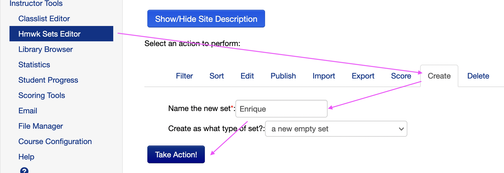
   <!--  -->


2. Entrar a editar la tarea ("edit set", que salga la lista de problemas)
   
   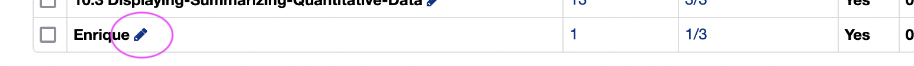   
   <!--  -->

   seguido de...
   
   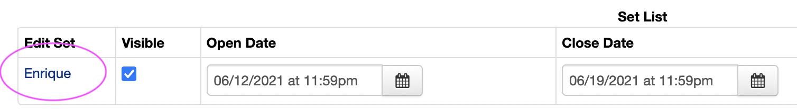
   <!--  -->


3. Agregar un blank problem a la tarea:
   
   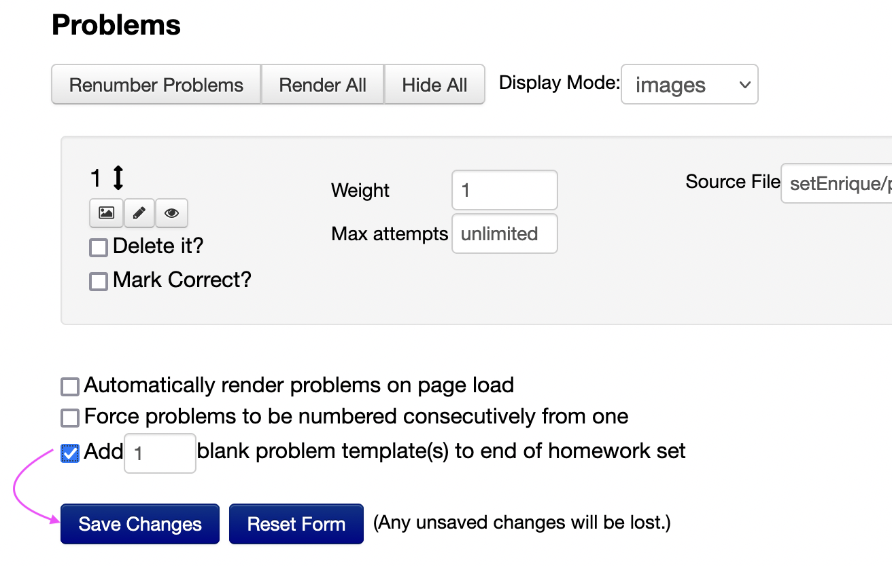
   <!--  -->


4. Entrar a editar el nuevo problema con el botón del lápiz:
   
   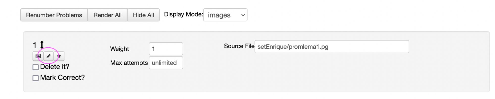
   <!--  -->


## La estructura básica de un archivo .pg (usando PGML)

*  Ver archivo `plantillaPGML-EstructuraBasica.pg` (en la carpeta [plantillas-machotes-PGML](plantillas-machotes-PGML)).
*  Hay espacios en los que el lenguaje es Perl, otros en los que es PGML... es un archivo "híbrido".
*  Matemáticas con LaTeX:
     * LaTeX math-mode ($...$): ``[`...`]``
     * LaTeX displaystyle ($\displaystyle...$): `[``...``]`
     * LaTeX en display-mode ($$...$$): `[```...```]`

## Vista previa de los cambios

*  Preview con el botón "ver---> ejecutar" (View --> Take Action)
*  Ejercicios básicos de escribir matemáticas en enunciado, agregar hint, escribir solución.
   
   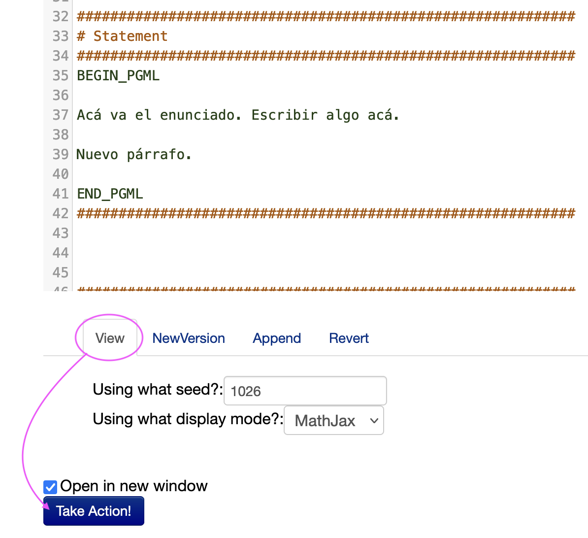
<!--  -->


## Crear un nombre apropiado para el archivo y guardar los cambios

Hay que darle un nombre al archivo (que no quede como el nombre por defecto blankProblem.pg porque eso causa problemas).


Para hacer esto:

*  Nueva versión ---> un buen nombre (e.j. setEnrique/problema1.pg)
   
   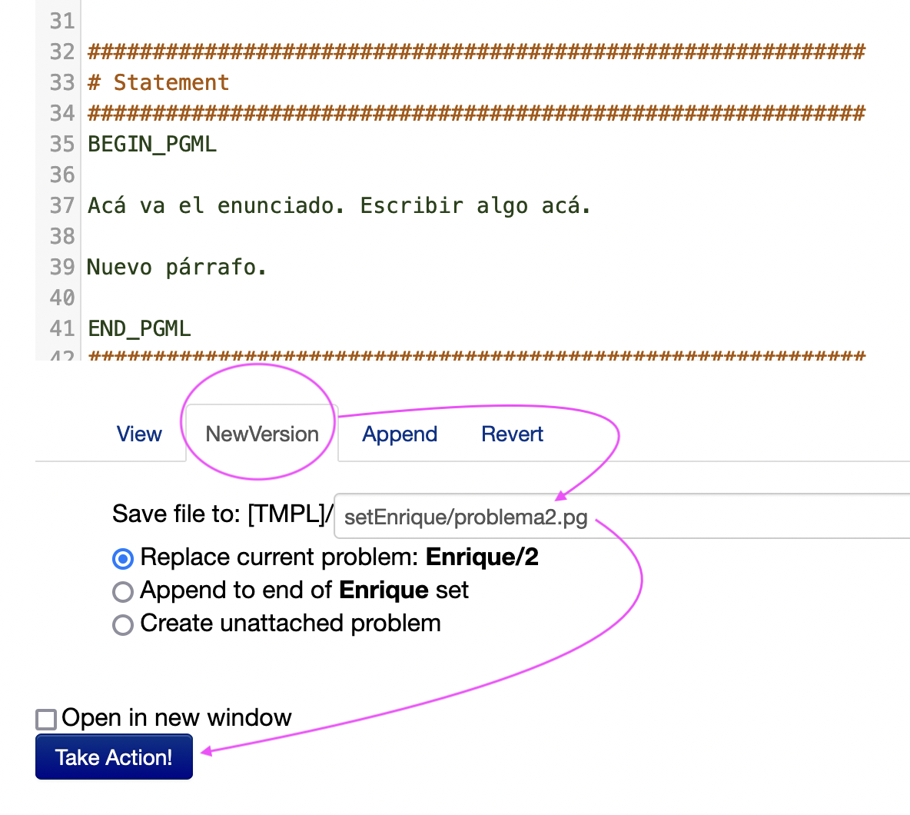
<!--  -->


## Como guardar cambios una vez el archivo tenga el nombre correcto
   
   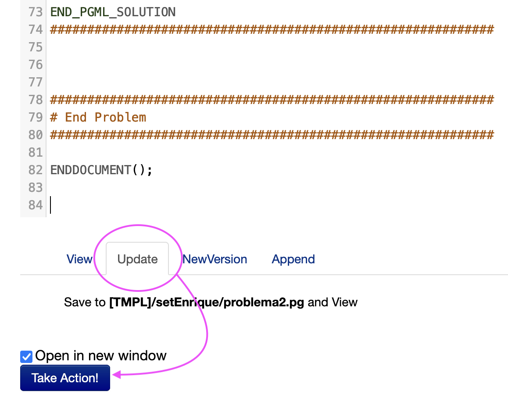
<!--  -->


## Descargar los archivos .pg

1. Ir a admin archivos y crear "archive" (tgzip)
   
   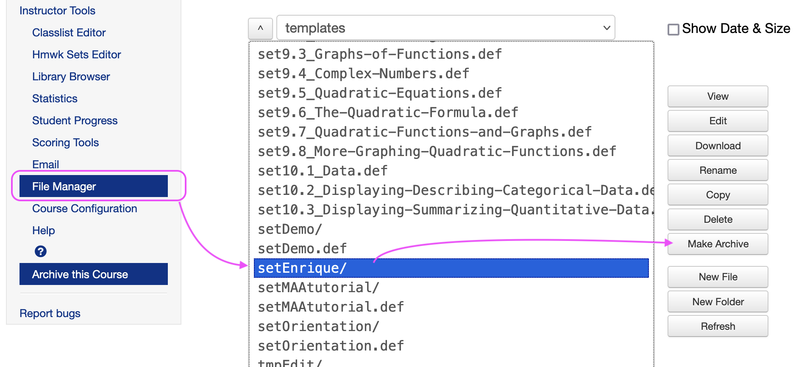
<!--  -->


2. Seleccionar el tgzip que se creó y descargarlo.
   
   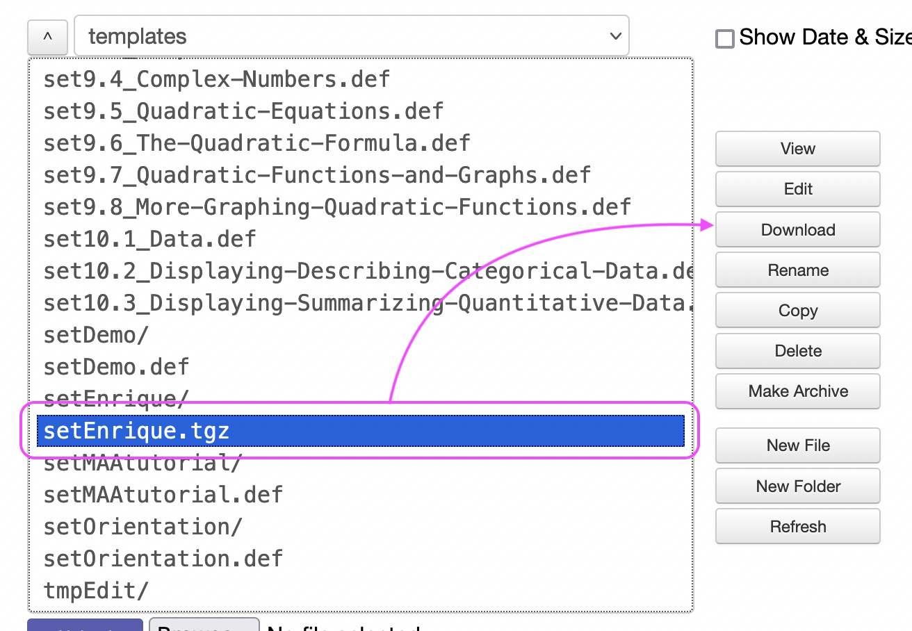
<!--  -->


## Campos de respuesta y cómo programarlos

### Los contextos, el "Compute", el objeto de respuesta.

Ver `plantillaPGML-CampoRespuesta.pg`

*  Escondido en el hint hay ejemplos de cómo:
   +  cambiar el tamaño de campo de respuesta y
   +  agregar ayudas de ingreso de respuestas "AnswerFormatHelp.pl".
*  Ver la respuesta correcta como la va a ver el estudiante chuleando "Correct Answers" antes de presionar "Check Answers"

### Números y tolerancias

Ver `plantillaPGML-CampoRespuestaTolerancia.pg`


### Expresiones algebraicas

*  Constructos y evaluación: `plantillaPGML-ExpresionesConstructos.pg`
*  Variables distintas a x (ajustes a contextos): `plantillaPGML-ExpresionesVariables.pg`
*  Dominios para ajustar equivalencias algebraicas (y más sobre ajustes a contextos - deshabilitar funciones y operadores): `plantillaPGML-ExpresionesDominio.pg`
*  Más info de contextos: https://webwork.maa.org/wiki/Introduction_to_Contexts
*  variables con símbolos distintos (por ejemplo θ). Ver `plantillaPGML-ExpresionesConVariablesRaras.pg`
*  Expresiones con dominio entero (por ejemplo, para poder evaluar expresiones con (-1)^n, o n! de forma correcta: `plantillaPGML-ExpresionesDominioEnteros.pg`
*  más info sobre expresiones: https://webwork.maa.org/wiki/Formula_(MathObject_Class)
*  y un link especifico sobre `flags` para contextos: https://webwork.maa.org/wiki/Context_flags

### Puntos

Ver `plantillaPGML-Puntos.pg`


### Listas (pueden ser de puntos, expresiones, números, etc.)

Ver `plantillaPGML-Listas.pg`


### Más info sobre contextos y math objects

*  https://webwork.maa.org/wiki/Introduction_to_Contexts

*  https://webwork.maa.org/wiki/Category:MathObject_Classes


### Selección múltiple

*  Selección Múltiple: `plantillaPGML-SelMultiple.pg`
*  Lista desplegable: `plantillaPGML-Dropdown.pg`
*  Ejemplo con pg (se ve bastante más complejo): https://webwork.maa.org/wiki/MultipleChoiceProblems

### Otros MathObjects:

intervalos, números complejos, vectores, matrices, conjuntos, cadenas

https://webwork.maa.org/wiki/Category:MathObject_Classes

## Aleatorización

### La parte del algoritmo

*  `plantillaPGML-Randomizacion.pg`
*  Para ver distintas versiones ---> cambiar seed y volver a presionar el botón para ver el problema "ver---> ejecutar" (View --> Take Action)
*  Ejercicio: Programar: "Soluciona z^2=25" con aleatorización.

### Errores comunes al agregar aleatorización

Apenas uno comienza a trabajar con valores aleatorios, comienzan a aparecer problemas como 1x, 4+-3x, 0x, x^1,...

*  `plantillaPGML-RandomizacionPitfalls.pg`
*  `plantillaPGML-RandomizacionPitfalls2.pg`
*  Más info sobre el "reduce" en: https://webwork.maa.org/wiki/Reduction_rules_for_MathObject_Formulas

### Uso de condicionales para evitar aleatorizaciones problemáticas

`plantillaPGML-RandomizacionCondiciones.pg`


### El error básico cuando se está aleatorizando:
El error es empezar a programar un problema pensando en la aleatorización y no en el estudiante. Antes de aleatorizar, hay que pensar primero: 

*  ¿Cómo se debería ver el problema en WeBWorK? 
*  ¿Cuáles y cuántos  son los campos de respuesta que voy a crear?

¡Programar un problema en WeBWorK no es escribir el algoritmo de aleatorización!


### Estar pendiente de cómo se ven las respuestas para los estudiantes

**Recomendación:** revisar siempre como están viendo los estudiantes la respuesta. El constructo "Compute" en vez de especificar el tipo de objeto en la variable de respuesta a veces es útil.

*  `plantillaPGML-RandomizacionRespuestasParaEstudiantes.pg`
*  Link de referencia (explicando el "Compute"): https://webwork.maa.org/wiki/Introduction_to_MathObjects


## Problemas con partes a,b,c
*  `plantillaPGML-Partesabc.pg`
*  En partes que no se pueden ver hasta que se haya respondido la parte anterior correctamente:
`plantillaPGML-PartesSeparadas.pg`


## Mostrar números sin decimales:
En el contexto numérico, ajustar como se muestan las constantes, y crear el número como un objeto `Formula`. Ejemplo: 
```
Context()->flags->set(reduceConstants => 0, reduceConstantFunctions => 0);
$f = Formula("(1+sqrt(5))/2)");
```
Esto hace que `$f` se muestre al estudiante como `1 + sqrt(5))/2` y no como `1.61803`.

## Imágenes

### Agregar una imagen "estática" propia a un problema.

Formatos aceptados: png, gif, jpeg. Se recomiendan los archivos PNG pues a menudo se ven mejor con cambios de escala.

Si quiere agregar una imagen `figura.png` y el problema está en la carpeta `local/tarea3/problema2.pg`, entonces hay que crear una carpeta con el mismo nombre que el problema (en este caso `local/tarea/problema2/`) y dentro de esta carpeta poner los archivos `problema2.pg` y `figura.png` que se va a agregar.

Se ve así (en el file manager):

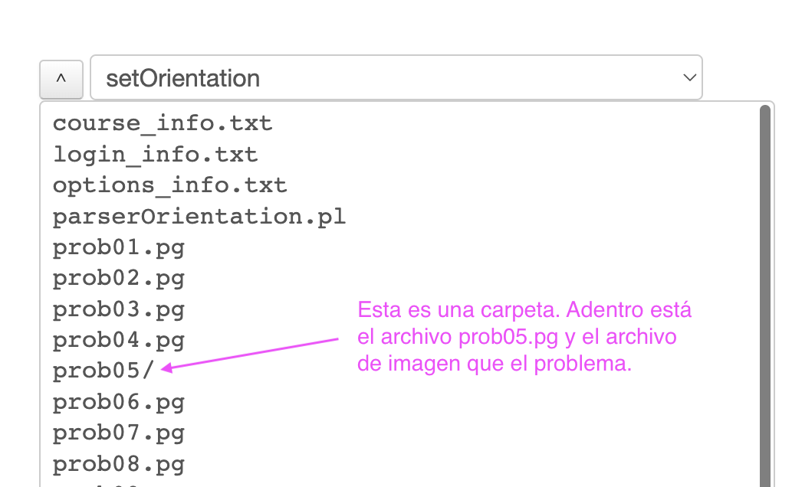


Para agregar la imagen en el problema .pg se usa en PGML (note el `*` al final):
```
[@ image("imagen.png", width=>180) @]*
```
o si se quiere que la imagen esté centrada, se usan los comandos `>>...<<` para centrar. Así:
```
>> [@ image("imagen.png", width=>180) @]* <<
```


### Aleatorizar la imagen que se carga
Si se tienen varias imágenes ya creadas y se quiere cambiar cuál se carga de acuerdo a la aleatorización del problema, se debe ajustar el código de autorización para guardar el nombre de la imagen variablen que se va a cargar, digamos `$fig="nombreImagenEnAleatorizacion.png"` y usar

```
>> [@ image("$fig", width=>180) @]* <<
```

### Usar TikZ para que WeBWorK genere imágenes (aleatorizadas o no) directamente dentro del código.pg
A partir de WeBWorK 2.16, se puede agregar código TikZ directamente en los archivos pg para que WeBWorK genere la imagen cuando el estudiante carga el problema. Esto incluso permite agregar elementos aleatorizados a las imágenes (como números en variables pg).

Ver: https://webwork.maa.org/wiki/TikZImages


### Generar imágenes directamente con código pg - sistema básico
Previo a WeBWorK 2.16, el único sistema para generar imágenes internamente en WeBWork usaba`PGgraphmacros`. Estas imágenes son de baja resolución y no permiten usar LaTeX.

Ver
https://webwork.maa.org/wiki/DynamicImages


## Recomendaciones generales al programar

*  Tratar de hacer el pensamiento de estudiante visible con campos de respuesta (no solo la respuesta correcta).
*  Hay que pensar en todas las respuestas aceptables, y aceptarlas todas como correctas. Ejemplos:
   -  Tolerancia numérica para tener en cuenta redondeos de números en cálculos intermedios, o advertirle al estudiante que solo se va a aceptar la respuesta exacta.
   -  Uso de constantes +c (en integración). ¿Otras letras para las constantes?
*  Hay que ser claro con el estudiante en qué se espera.
   -  "Usa C como constante de integración."
   -  "Escribe la respuesta exacta, o aproxima a la milésima más cercana." (puede que en este caso el campo de respuesta califique a menos decimales, por redondeos intermedios).
   -  "Usa $r$ para el radio en tu respuesta."
*  La aleatorización se piensa después de pensar los campos de respuesta, no antes.
*  La aleatorización no puede tener versiones más complejas para los estudiantes.
*  Los Hints son importantes (a menudo sirve dar una versión del principio de la solución escrita como hint). Las soluciones completas sirven si el profesor las va a hacer disponibles.

## Revisión de problemas programados por otros para que queden listos para uso

*  Revisar cómo se ven la respuestas (check "CorrectAnswers" antes de presionar el botón de "CheckAnswers")
*  Revisar que no haya errores causados por la aleatorización en los textos que ve el estudiante (pitfalls): revisar varios seeds.
*  Revisar que el problema acepte todas las posibles respuestas y formas de respuesta válidas. Revisar varios seeds.
*  Revisar que el problema no marca respuestas incorrectas como correctas.

## PGML vs PG
*  Wiki: https://webwork.maa.org/wiki/Authors
*  subject area templates, ODE
https://webwork.maa.org/wiki/GeneralSolutionODE1
*  subject area templates, Calculus, linear approximation
https://webwork.maa.org/wiki/LinearApprox1
*  OPL y cómo uno puede "clonar" cualquier problema.

## Ejemplos más complejos

*  Dropdown o Multiple Choice en le que la respuesta correcta es aleatoria: `plantillaPGML-RandomizacionesDropdownRespuestaCorrectaAleatoria.pg`

*  Mensajes para el estudiante de acuerdo a lo que responden: `plantillaPGML-MensajesAdaptativos.pg`

*  Evaluar dos campos al tiempo, o en distinto orden: `plantillaPGML-DosCamposSinOrden.pg`

*  Aceptar todos los múltiplos negativos de una expresión: `plantillaPGML-ExpresionesInfinitasRespuestas.pg`

*  Evaluar un ángulo módulo 2pi: `plantillaPGML-numerosModulo2pi.pg`

*  Evaluar ecuaciones equivalentes, no permitir algunas operaciones en la repuesta, y cambiar la definición de log (que no sea ln): `plantillaPGML-EcuacionesOperadoresYLogs.pg`

*  Evaluar vectores paralelos: `plantillaPGML-vectoresParalelos.pg`

<!-- *  PENDIENTE: StressTests (Consortium)
   1.  Question with algorithmic graph in the statement
   2.  Question with algorithmic graph in the statement:
   3.  A question in which the student answer can have an arbitrary letter as a constant
   4.  A question that grades a symbolic expression involving a function and a hint
   5.  One that has an angle answer field which grades mod 2pi
   6.  Questions with tolerance for coefficients in expressions
   7.  Grade depending on other student responses
   8.  Check for a composition of functions
*  Evaluar parametrizaciones de superficies (email Eric)
 -->
### Un buen resumen corto con algunos temas más complejos:
https://github.com/drdrew42/WeBWorK-problem-authoring/blob/main/intro.md 
